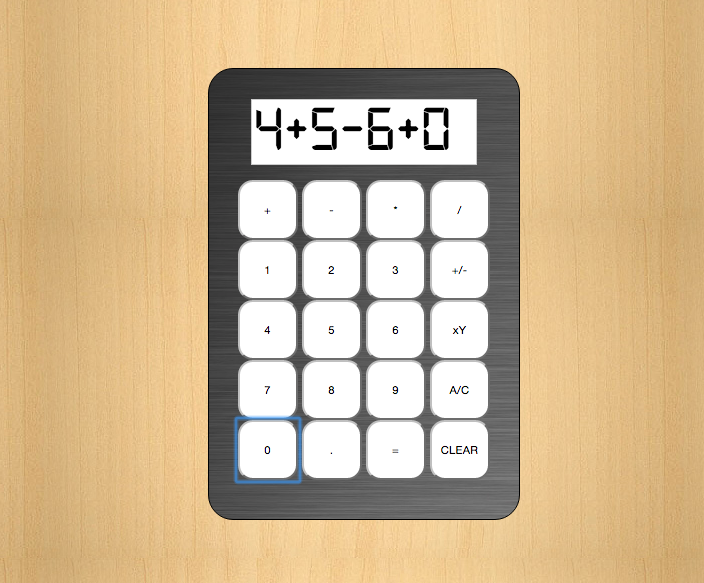

<h1>c5_calculator</h1>

<h2>Description:</h2>

Build a funcitonal calculater that resembles one I would use in a basic math class or on my phone.

<h2>Feature List:</h2>
- Add
- Subtract
- Multiply
- Divide
- If divided by 0, an error will be shown on screen and calculation would stop
- Exponent - Take the first number and multiply it by itself the amount of times entered as the second number
- Decimals - So the calculator can not only use whole numbers but decimals as well
- Clear - Clears the last number entered.
- A/C - Resets calculator to its' original empty state
- Positive/Negative - Will either start the next number as a negative or change number already entered into a negative.  If the number entered is already a negative, and this button is pushed again, it will revert it back to positive
- Successive mathematical operations - will not calculate until the equals (=) button is pushed

<h2>What I've learned working on this:</h2>
- Testing all possible inputs/outcomes will show what bugs need to be worked out when the outcome is not what I was expecting
- Calculators seem very easy, but the logic behind them is very complicated
